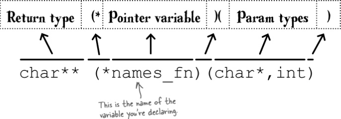

# Advanced  Functions
### Every function name is a pointer to the function

Think about what the **name of a function** really is. It's a way of *referring* to the piece of code.  
And that's just what a pointer is: **a way of referring to something in memory**.
That's why, in C, function names are also pointer variables.  
When you create a function called go_to_warp_speed(int speed), you are also creating a pointer variable called go_to_warp_speed
that contains the address of the function. So, if you give find() a parameter that has a *function pointer* type, you should
be able to use the parameter to call the function it  points to.

### How to create function pointers
```
int (*warp_fn) (int);
warp_fn = go_to_warp_speed;
warp_fn(4);

char** (*names_fn) (char*,int);
names_fn = album_names;
char** results = names_fn("Sacha Distel", 1972);

```

That looks pretty complex, doesn't it?  
Unfortunately, it has to be, because you need to tell C the return type and the parameter types the function will take.  
But once you've declared a function pointer variable, you can use it like any other variable.  
You can assign values to it, you can add it to arrays, and you can also pass it to functions.

This might help to memorize and understand function pointers a little better:  


```
qsort(void *array,
	size_t length,
	size_t item_size,
	int (*compar) (const void *, const void *));
```
const void * is a function pointer and it can point to anything

## Q&A

***What does char\*\* mean?***  
char** is a pointer normally used to point to an array of strings.  

***If function pointers are just pointers, why don't you need to prefix them with a \* when you call the function?***  
You can. In the program, instead of writing match(ADS[i]), you could have written (*match)(ADS[i]).

***And could I have used & to get the address of a method?***  
Yes. Instead of find(sports_or_workout), you could have written find(&sports_or_workout).

***Then why didn't I?***  
Because it makes the code easier to read. If you skip the * and &, C will still understand what you're saying.

