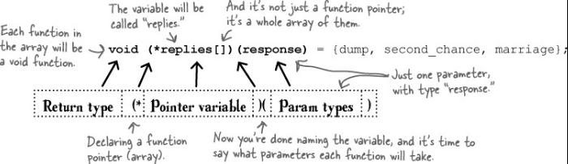
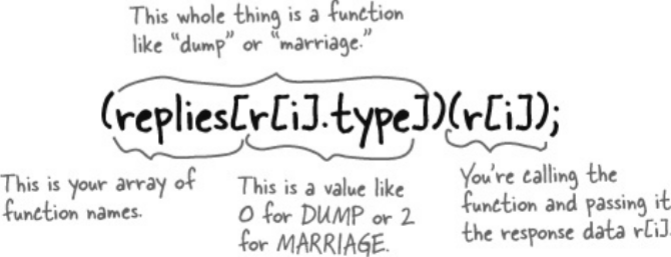
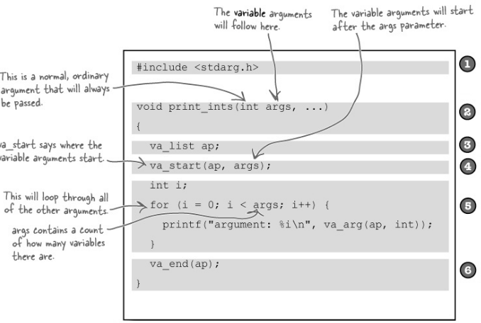
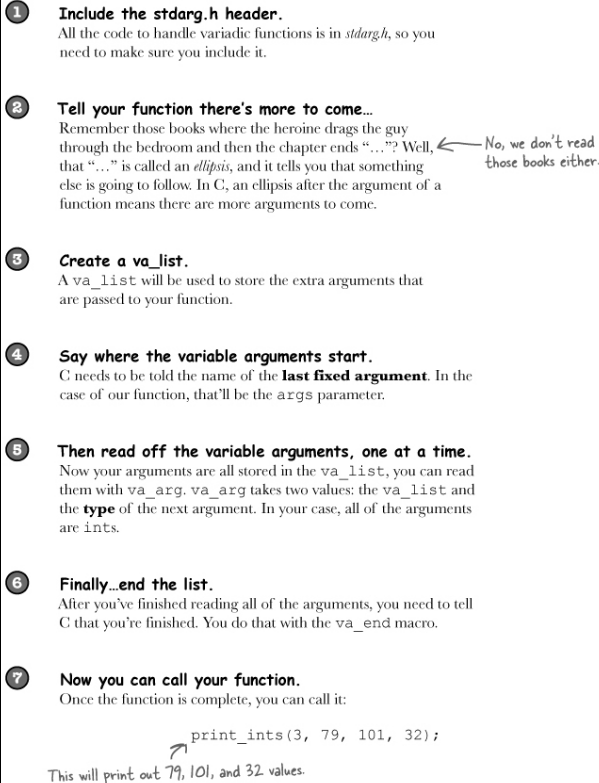

# Advanced  Functions
### Every function name is a pointer to the function

Think about what the **name of a function** really is. It's a way of *referring* to the piece of code.  
And that's just what a pointer is: **a way of referring to something in memory**.
That's why, in C, function names are also pointer variables.  
When you create a function called go_to_warp_speed(int speed), you are also creating a pointer variable called go_to_warp_speed
that contains the address of the function. So, if you give find() a parameter that has a *function pointer* type, you should
be able to use the parameter to call the function it  points to.

### How to create function pointers
```
int (*warp_fn) (int);
warp_fn = go_to_warp_speed;
warp_fn(4);

char** (*names_fn) (char*,int);
names_fn = album_names;
char** results = names_fn("Sacha Distel", 1972);

```

That looks pretty complex, doesn't it?  
Unfortunately, it has to be, because you need to tell C the return type and the parameter types the function will take.  
But once you've declared a function pointer variable, you can use it like any other variable.  
You can assign values to it, you can add it to arrays, and you can also pass it to functions.

This might help to memorize and understand function pointers a little better:  


```
qsort(void *array,
	size_t length,
	size_t item_size,
	int (*compar) (const void *, const void *));
```
const void * is a pointer that can point to anything

Values are always passed to the function as pointers, so the first thing we need to do is get the 
integer values from the pointer:

```a
int a = *(int*)score_a;
int b = *(int*)score_b;
```
We need to cast the void pointer to an integer point.  
The first * then gets the int stored at address score_b.

Then we need to return a positive, negative or zero value, depending on whether a is greater than, less than, or equal to b.  
For integers that's pretty easy to do - we just need to subtract one number from the other.

And this is how we ask qsort() to sort an array:
```
qsort(array, 7, sizeof(int), compare_scores);
```
Where 7 is just the length of the array.

## Q&A

***What does char\*\* mean?***  
char** is a pointer normally used to point to an array of strings.  

***If function pointers are just pointers, why don't you need to prefix them with a \* when you call the function?***  
You can. In the program, instead of writing match(ADS[i]), you could have written (*match)(ADS[i]).

***And could I have used & to get the address of a method?***  
Yes. Instead of find(sports_or_workout), you could have written find(&sports_or_workout).

***Then why didn't I?***  
Because it makes the code easier to read. If you skip the * and &, C will still understand what you're saying.

## Create an array of function pointers

If we had an array variable that could store a whole bunch of function names, you could use it like this:  
`replies[] = {dump, second_chance, marriage};`  
But that syntax doesn't quite work in C. We have to tell the compiler exactly what the functions will look like 
that we are going to store in the array: what their return types will be and what parameters they'll accept.  
That means we have to use this **much more complex** syntax:  



### How they come together

`enum response_type {DUMP, SECOND_CHANCE, MARRIAGE};`  
This enum stores a value for each item (0,1,2...)  

And that is amazing because it means we can get a pointer to one of our functions using a **response_type**:  
`replies[SECOND_CHANCE] == second_chance;`

So to call it we can use this:  


### Bullet Points
 - Function pointers store the address of functions.
 - The name of each function is actually a function pointer.
 - If you have a function shoot(), then shoot and &shoot are both pointers to that function.
 - You declare a new function pointer with return-type(*var-name)(param-types).
 - If fp is a function pointer, you can call it with fp(params, ...).
 - Or, you can use (*fp)(params, ...). C will work the same way.
 - The C Standard Library has a sorting function called qsort().
 - qsort() accepts a pointer to a ***comparator function*** that can test for (in)equality.
 - The comparator function will be passed **pointers** to two items in the array being sorted.
 - If you have an array of data, you can associate functions with each data item using function pointer arrays.


## Q&A
***Why is the function pointer array syntax so complex?***  
Because when you declare a function pointer, you need to say what the return and parameter types are.  

***This looks a little like the sort of object-oriented code in other languages. Is it?***  
It's similar. Object-oriented languages associate a set of functions (called *methods*) with pieces of data.
In the same way, you can use function pointers to associate functions with pieces of data.  

***Hey, so does that mean that C is object oriented?***  
No. C is not object oriented, but other languages that are built on C, like Objective-C and C++, create a lot of their
object-oriented features by using function pointers under the covers.

## Variadic functions

A function that takes a variable number of parameters is called a ***variadic function.***  
The C Standard Library contains a set of **macros** that can help us create our own variadic functions.  



### Functions vs. macros

A ***macro*** is used to rewrite the code before it's compiled. The macros we're using here (va_start, va_arg, and va_end)
might look like functions, but they actually hide secret instructions that tell the *preprocessor* how to generate lots of
extra smart code inside our program, just before compiling it.

## Q&A
***What is a preprocessor?***  
The preprocessor runs just before the compilation step. Among other things, the preprocessor includes the headers into the code.

***Can We have a function with just variable arguments, and no fixed arguments at all?***  
No. We need to have at least one fixed argument in order to pass its name to va_start.  

