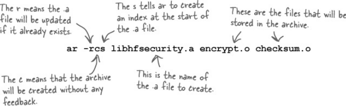

# Static and Dynamic Libraries: Hot-swappable code

### Archive Files
Archive Files end with ".a". These are files that contain object files.  
We can list the contents of the archive file type by using the "nm" command. "nm" stands for "names".  
Archives are created by using the **"ar"** command.  
In the following picture we can see exactly how it is done.  

We need to make sure we name our .a files after the standard ***lib\<something>.a***  
After we successfully created the .a file we need to move it to the standard directory ***/usr/local/lib***.

### Bullet Points
 - Headers in angle brackets are read from the standard directories.
 - A library archive contains several object files.
 - Library archive names should begin lib. and end .a.
 - If we need to link to an archive called libfred.a, use -lfred.
 - The -L flag should appear after the source files in the gcc command.
